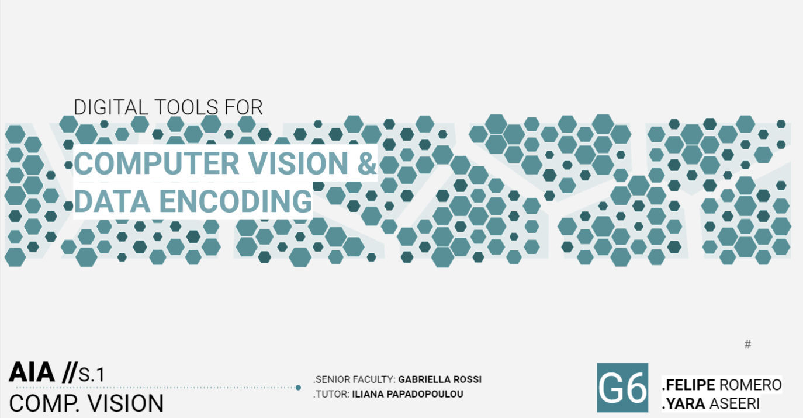

# MaCAD-AIA_DataEncoding

 This is the final submission for Digital Tools for Computer Vision & Data Encoding seminar which is part of the Artificial Intelligence in Architecture term 2020-2021 at IaaC. Team: Felipe Romero & Yara Gadah

// Directions: 
There are two scenarios in this repo to perform direct sun prediction on an urban context. Choose one of them and follow the steps bellow: 
1.	 Clone the repository. 
2.	In the Colab Notebook, choose one of the scenarios to run the PCA analysis as well as to train the model. 
3.	Once the model is trained, export the .h5 and make sure you have your scalerx and scalery downloaded as well in one folder in your VCS project. 
4.	Add and replace the .h5, scalerX, and scalerY files to the VCS folder in both apps.py and runPythonapp.py files. 
5.	Open the provided Grasshopper file and load the provided URL from the Visual Studio terminal into Hops
